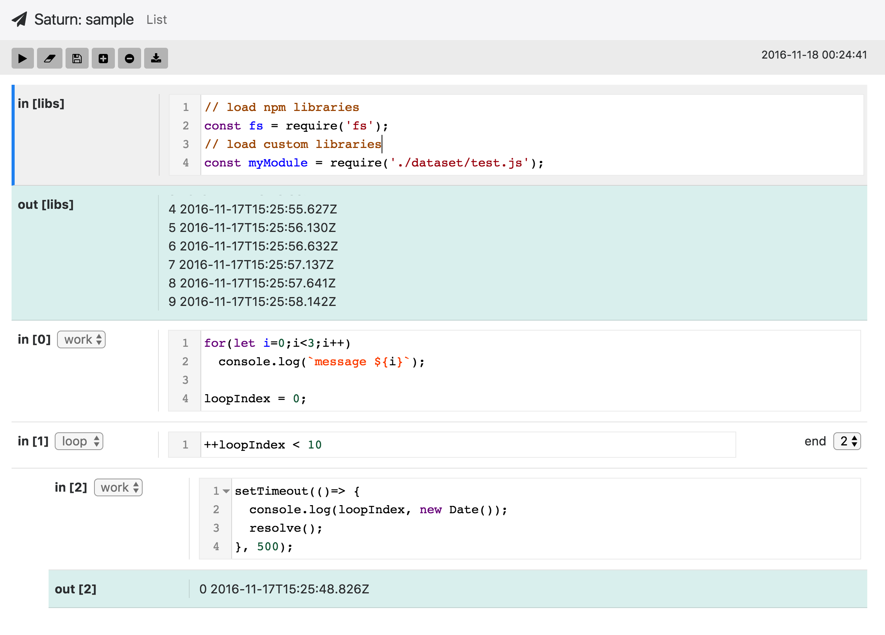

# Saturn

Saturn is opensource, node.js workspace framework (like `Python Jupyter`)


## Installation

### How to start

```bash
npm install -g lwot
git clone https://github.com/proin/saturn 
cd saturn
lwot install
lwot build
lwot express run
# then started at your browser, localhost:3000
```

### Run as Daemon

```bash
lwot express forever start # after launched, press Ctrl+C
lwot express forever stop # stop daemon
lwot express forever log # show logs
```

### Update Saturn

```bash
cd saturn
git pull
lwot build
lwot express run
```

## How to Use

### Project & File List


- function in buttons
    - select all
    - create project
    - create folder or js file
    - upload file
    - delete file or project
- function in UI
    - drag & drop files for uploading

### Project



- Structure
    - `libs`: global library & function in here 
    - `work`: if you are using async functions, you must call `resolve()` in the end
    - `loop`: set loop processing condition, `e.g) index < 10`, if condition is true, run under works
    
### Examples Usage

#### code in libs

```javascript
// this calls node_modules
const fs = require('fs');
const path = require('path');

// this calls module in WORKSPACE ROOT PATH
const myFunction = require('./work.js'); 

// define global function
let myApp = (a,b)=> return a + b;
```

#### code in work

```javascript
index = 0; // define global variable
let message = `Hello ${index}`; // define local variables, this can use only in this work

setTimeout(()=> {
    // resolve must call in last, if async.
    // if the work is sync, it is not necessary.
    resolve();  
}, 1000);
```

#### code in loop

```javascript
index < 10 // run condition, if true, it run! 
```