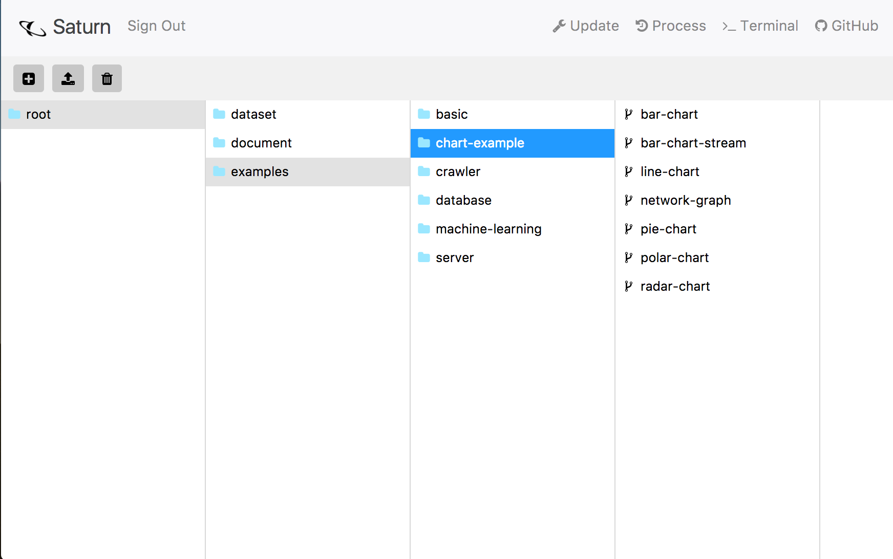
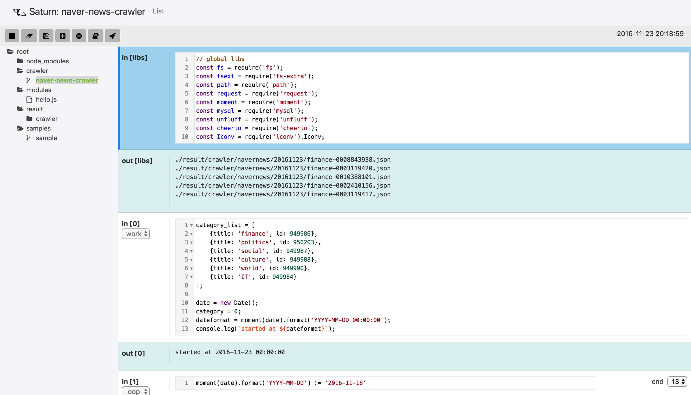
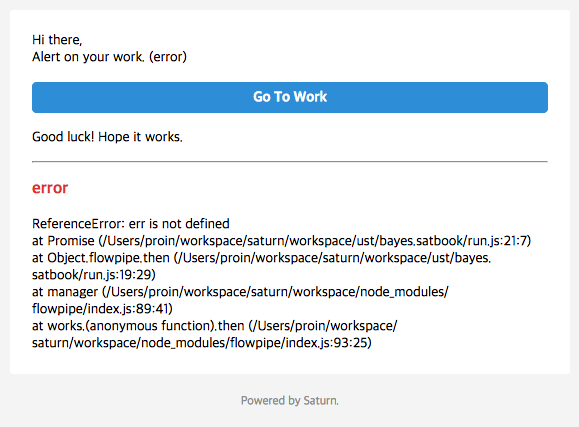

# Saturn

- Saturn is opensource, node.js workspace framework (like `Python Jupyter`)
- Demo in here, [http://saturn.proinlab.com:3000](http://saturn.proinlab.com:3000)
- Node.js version upper than 6.x.x
- Only tested at Chrome Browser

## Quick Reference

- [common usage](http://workspace.proinlab.com:3000/#/examples/basic)
- [chart demo](http://workspace.proinlab.com:3000/#/examples/chart-example)
- [crawler demo](http://workspace.proinlab.com:3000/#/examples/crawler)
- [machine learning](http://workspace.proinlab.com:3000/#/examples/machine-learning)
- [web server](http://saturn.proinlab.com:3000/#/examples/server)
- [using python](http://saturn.proinlab.com:3000/project.html#/examples/basic/using-python.satbook)

## Features


- Easy install by [LWOT](http://github.com/searble/lwot)
- Browsing file in your server
- Intuitive asynchronous loop management
- Unit test available, even though asynchronous loop
- Visualized work status (running, finish, error)
- Mailing on event (error, finish)
- Live Graph Log (refer Chart section)
- Comming soon
    - Work scheduling (once a day, once a week, etc..)

## Versions

When we finish that we think about, we will update version upper 1.x.x

- 0.x.__***x***__ 
    - bug fixed
- 0.__***x***__.0
    - functional added

## Installation

### How to start

```bash
npm install -g lwot
git clone https://github.com/proin/saturn 
cd saturn
bower install
cp ./controller/express/config-sample.json ./controller/express/config.json
lwot install
lwot build
lwot express run
# then started at your browser, localhost:3000
```

### Run as Daemon

```bash
lwot express forever start # after launched, press Ctrl+C
lwot express forever stop # stop daemon
lwot express forever log # show logs
```

### Update Saturn

```bash
cd saturn
git pull
bower install
lwot build
lwot express run
```

### Configuration

- you can change configuration editing by `./controller/express/config.json` file

```js
{
    "port": 3000, // server port to bind
    "home": "./saturn-project", // workspace home, start from USER HOME
    "dev": true, // display express log
    "log": true, // display thread log
    "hostname": "http://localhost", // direct url
    "smtp": { // emailjs configuration object
        "host": "smtp.your-site.net",
        "user": "user@your-site.net",
        "password": "password",
        "ssl": true
    },
    "mailingList": "your@mail-address.net, co-worker@mail-address.net", // who are received? 
    "mailingOn": {
        "error": true, // mail when error occured 
        "finish": true // mail when work finished
    },
    "readonly": true, // readable project for whom not signin users
    "user": "admin", // admin user
    "password": "admin123", // admin password
    "session": {
        "secret": "sAtuRN-seSsIon-sEcreT",
        "resave": false,
        "saveUninitialized": false
    },
    "MAX_HEAP": 16, // node.js heap memory size
    "MAX_LOG": 500, // display log size
    "encrypt": "sAtuRn"
}
```

## Overview

### Project & File List



- function in buttons
    - select all
    - create project
    - create folder or js file
    - upload file
    - delete file or project
- function in UI
    - drag & drop files for uploading

### Project



- Structure
    - `libs`: global library & function in here 
    - `work`: if you are using async functions, you must call `resolve()` in the end
    - `loop`: set loop processing condition, `e.g) index < 10`, if condition is true, run under works

### Email Alert


    
- you can set on this function at `./controller/express/config.json` file
    
## How to Use

### code in libs

```javascript
// this calls node_modules
const fs = require('fs');
const path = require('path');

// this calls module in WORKSPACE ROOT PATH
const myFunction = require('./work.js'); 

// define global function
let myApp = (a,b)=> return a + b;
```

### code in work

```javascript
index = 0; // define global variable
let message = `Hello ${index}`; // define local variables, this can use only in this work

setTimeout(()=> {
    // resolve must call in last, if async.
    // if the work is sync, it is not necessary.
    resolve();  
}, 1000);
```

### code in loop

```javascript
index < 10 // run condition, if true, it run! 
```

### Chart.js

- we can use [chart.js](http://www.chartjs.org) for log
- refer [chart.js document](http://www.chartjs.org/docs) for use
- additionally, we can set `width`, `height`, `id` in code
    - `width` and `height` is set before rendering graph
    - `id` indicates specific graph, if you not set, it is auto created
        - if you set id, it replace older chart which has same id
- when `console.graph(data)` called in your code, it will update your graph
- below is examples for drawing chart, you write it in work code.
- chart example in here, [chart demo](http://workspace.proinlab.com:3000/#/chart-example)

```js
let data = {
    id: 'mychart',
    width: 300,
    height: 300,
    type: 'bar',
    animation: false,
    data: {
        labels: labels,
        datasets: [
            {
                label: "Bubble Sorting",
                backgroundColor: background,
                data: values,
            }
        ]
    },
    options: {
        scales: {
            yAxes: [{
                ticks: {
                    beginAtZero:true
                }
            }]
        }
    }
};

console.graph(data);
```

### Vis.js Network Graph

- we can use [vis.js network graph](http://visjs.org/docs/network/) for log
- when `console.vis(type, data, option)` called in your code, it will update your graph
- below is examples for drawing chart, you write it in work code.

```js
let nodes = [
    {id: 1, label: 'Node 1'},
    {id: 2, label: 'Node 2'},
    {id: 3, label: 'Node 3'},
    {id: 4, label: 'Node 4'},
    {id: 5, label: 'Node 5'}
];

// create an array with edges
let edges = [
    {from: 1, to: 3},
    {from: 1, to: 2},
    {from: 2, to: 4},
    {from: 2, to: 5}
];

let data = {
    width: '500px',
    height: '300px',
    nodes: nodes,
    edges: edges
};

var options = {};

// only use network graph at this time, other type of graph is now developing.
console.vis('network', data, options);
```